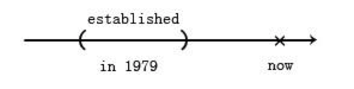
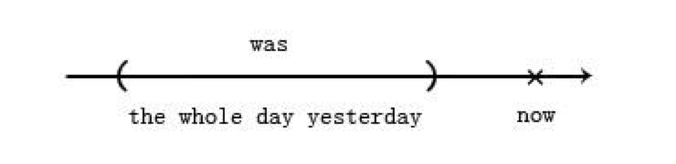
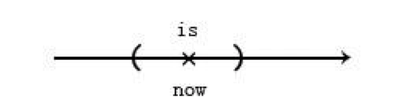

## Chatpter 03 动词时态

在现代语法中，时间(`time`)和状态(`aspect`)是分开处理的。时间观念（现在、过去、未来）比较简单，状态的观念比较麻烦

### 简单式

简单式的时间是括弧的形状。

#### 一、过去时间

```
The U.S. established diplomatic relations with the P.R.C in 1979.
美国与中华人民共和国于1979年建交。
```

<p align="center">
  
</p>

```
I was visiting clients the whole day yesterday.
昨天一整天我一直在拜访客户。
```

<p align="center">
  
</p>

现在分词表示一种持续性，相当于中文的“正在”、“一直”的口吻。

`be`动词不需要翻译，因为它是一个没有意义的连缀动词，连接主语“我”和补语“一直在拜访客户”。`be`动词只要负责交代时态就好。


#### 二、现在时间

真理以及事实要用现在简单式表示。只有在以`now`为中心的括弧，可以大到涵盖过去未来，才可以用来表示不变的真理。

```
Bush is the U.S. President.
布什是美国总统。
```
<p align="center">
  
</p>


