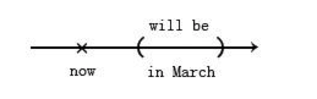
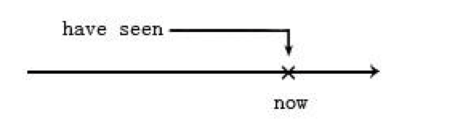
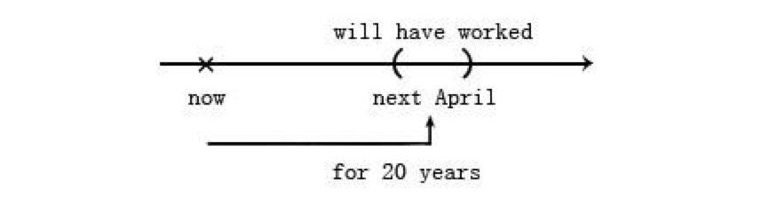

## Chapter 03 动词时态

在现代语法中，时间(`time`)和状态(`aspect`)是分开处理的。时间观念（现在、过去、未来）比较简单，状态的观念比较麻烦

### 简单式

简单式的时间是括弧的形状。

#### 一、过去时间

```
The U.S. established diplomatic relations with the P.R.C in 1979.
美国与中华人民共和国于1979年建交。
```

<p align="center">
  
</p>

```
I was visiting clients the whole day yesterday.
昨天一整天我一直在拜访客户。
```

<p align="center">
  
</p>

现在分词表示一种持续性，相当于中文的“正在”、“一直”的口吻。

`be`动词不需要翻译，因为它是一个没有意义的连缀动词，连接主语“我”和补语“一直在拜访客户”。`be`动词只要负责交代时态就好。


#### 二、现在时间

真理以及事实要用现在简单式表示。只有在以`now`为中心的括弧，可以大到涵盖过去未来，才可以用来表示不变的真理。

```
Bush is the U.S. President.
布什是美国总统。
```
<p align="center">
  
</p>

```
According to the NASA survey, the ozone layter is being depleted.
根据美国国家航空和航天局的研究，臭氧层正在被消耗中。
```

`being depleted`当做补语看待。`being`只有词尾`-ing`有意义，解释“正在...”。

#### 三、未来时间

未来时间的简单式，只是把括弧放在`now`的右边，其它的原理则完全相同。

```
There will be a major election in March.
三月将有一次大选。
```

<p align="center">
  
</p>


未来时间使用`will be`

### 完成式

相对于简单式用括弧来表达时间，完成式则是以箭头形状来表达时间，表示动作的截止时间。

从功能上来看，简单式是交待动作发生的时段，而完成式并不对动作发生的时段作明确的交代，只表示“曾经”、“做过”的意思。

#### 一、现在时间

```
I'm sure I have seen this face somewhere.
我肯定曾经见过这张脸。
```

<p align="center">
  
</p>

没有指明我是具体什么时候见过这张脸的，只知道一定有见过。也就是说，“看到”的动作没有明确括出来是哪一个时段发生的，只有一个箭头的形状，表示截止时间是现在。

#### 二、过去时间

过去完成式需要有一个过去的截止时间，也就是箭头指在一个过去时间。

```
Many soldiers had died from pneumonia before the discovery of penicillin.
发现盘尼西林以前，已经有很多士兵死于肺炎。
```

<p align="center">
  
</p>


#### 三、未来时间

把箭头所指的截止时间移到未来的一个点。在写法上面，因为是未来时间，所以动词前面加一个`will`就可以了。

```
Next April, I will have worked here for 20 years.
到四月份，我在这里就工作20年了。
```

<p align="center">
  
</p>

```
Come back at 5:00. Your car will have been fixed by then.
五点再来吧！到时候你的车一定已经修好了。
```
<p align="center">
  
</p>

### 结语

1. 把`be`动词当动词来看，句子就只剩下两种状态：**简单式**和**完成式**。
2. 简单式是以括弧型的时间来表达。
3. 完成式是以箭头型的时间来表达。
4. `be`动词后面的分词当作形容词补语。现在分词有正在进行的意思，过去分词有被动的意思。


